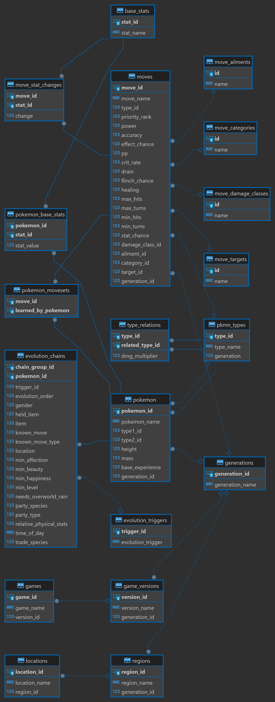

# Pokemon Data Project

## Overview

This project scrapes and stores Pokemon data in a PostgreSQL database. It includes data on generations, types, Pokemon, moves, and evolutions. The data is sourced from the PokeAPI and stored in a relational database for easy querying and analysis.

## Prerequisites

- Python 3.11
- PostgreSQL

## Setup Instructions

### 1. Clone the Repository

First, clone the repository to your local machine:

```sh
git clone https://github.com/yourusername/pokemon-data-project.git
cd pokemon-data-project
```

### 2. Create a Virtual Environment

Create and activate a virtual environment:

```sh
python -m venv venv
source venv/bin/activate  # On Windows, use `venv\Scripts\activate`
```

### 3. Install Dependencies

Install the required Python packages:

```sh
pip install -r requirements.txt
```

### 4. Set Up PostgreSQL (if not already used)

1. **Install PostgreSQL** If you haven't installed PostgreSQL, you can download and install it from [here](https://www.postgresql.org/download/).
2. **Create a new database**: It is recommended to create a new, clean database for this project. The defaulted name is *pokemon_db* but this is changeable, just ensure you change the db connection in `config.yaml`

```sh
psql -U yourusername -c "CREATE DATABASE pokemon_db;"
```

### 5. Update Configuration

Check and update the `config.yaml` file with your PostgreSQL connection details if they differ from the defaults:

```yaml
database:
  dbname: "pokemon_db"
  user: "postgres"
  password: "admin"
  host: "localhost"
  port: 5432
```

### 6. Run SQL Scripts

Execute the SQL scripts to create the necessary database schema. This should be done before running the Python scripts, as the Python scripts depend on the database schema.

```sh
psql -U yourusername -d pokemon_db -f sql/create_schema.sql
```

### 7. Run Python Scripts

Run the Python scripts to scrape data from online and populate the database. You can run them all in sequence using the provided `run_all.py` script.

```sh
python scripts/run_all.py
```

### Data Sourcing

The primary source of data for this project is from [PokeAPI](https://github.com/PokeAPI/pokeapi). They provide a fantastic RESTful API for accessing much more data than is compiled here.

### Additional Notes

- **Modular SQL Files:** The SQL code is stored in `sql` directory in modular format, these are executed in sequence by the `master_setup.sql` script.

- **Python Scripts:** The Python scripts predominantly scrape data from PokeAPI and populate the PostgreSQL database. Each script focuses on a specific part of the data (e.g., generations, types, Pokemon). 

- **Configuration:** The database connection parameters are configurable via the `config.yaml` file.


### Schema Diagram




### License

This project is licensed under the MIT License - see the LICENSE file for details.